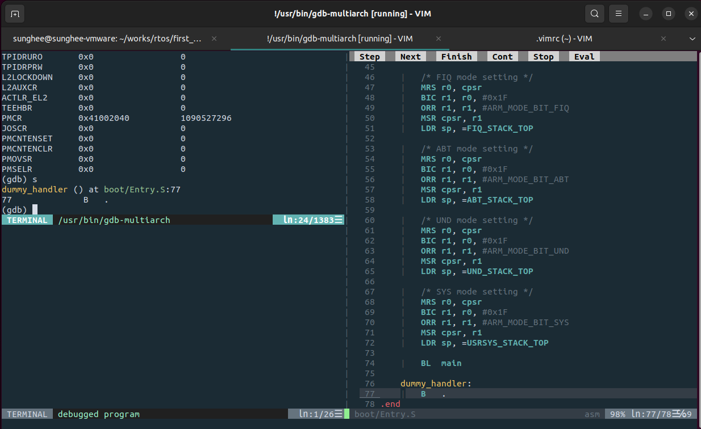

## GDB with Vim
Vim version >= 801 (8.01)  

### Settings & Execution for GDB
1. setting
    + :packadd termdebug
    + :let g:termdebugger='/usr/bin/gdb-multiarch'
2. execute
    + :Termdebug

### For auto-setting...
- open ~/.vimrc
- write followings..
```
if v:version >= 801
	packadd termdebug
	let g:termdebug_wide = 1
    let g:termdebugger='/usr/bin/gdb-multiarch'
endif
```

### [image - gdb in vim]



## GDB Commands
| cmd | description |
|-----|-------------|
| `list [x,y]` | print source from x ~ y line | 
| `run` | execute this file |
| `b [file_name]:[function_name \| line_num]` | breakpoint |
| `b *0x38030012` | breakpoint with address |
| `continue` | continue to execute after break |
| `info b` | show list of breakpoints |
| `d [num]` | delete breakpoints with num <br>(info b) |
| `x/[s \| x \| u] address` | show value of address <br> (string, hex, decimal) |
| `next` | next line <br>(no enter into function) |
| `step` | next line <br>(enter into function) |
| `info reg [reg_name]` | show value of register <br> (no reg_name, then all regs) |